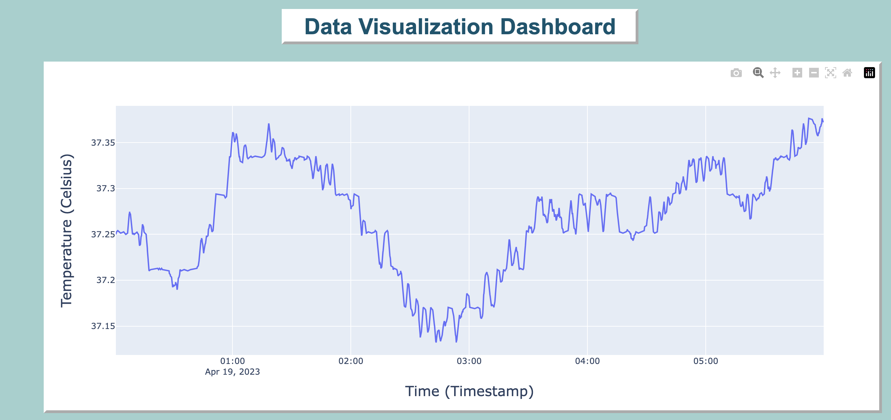
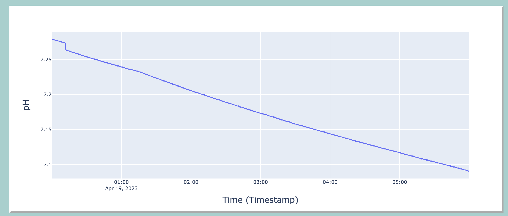
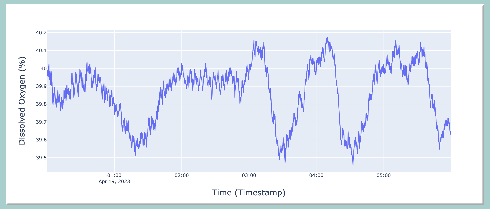
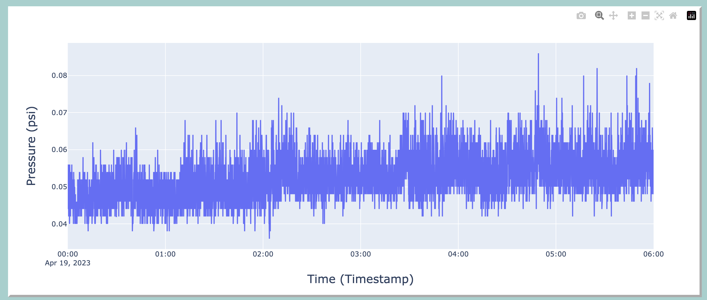

# Data-Visualization-Dashboard
Developed a web-based data visualization dashboard for a bioreactor using Flask, Python, Docker, Plotly, pandas, and HTML/CSS. The pictures below show the web app:

